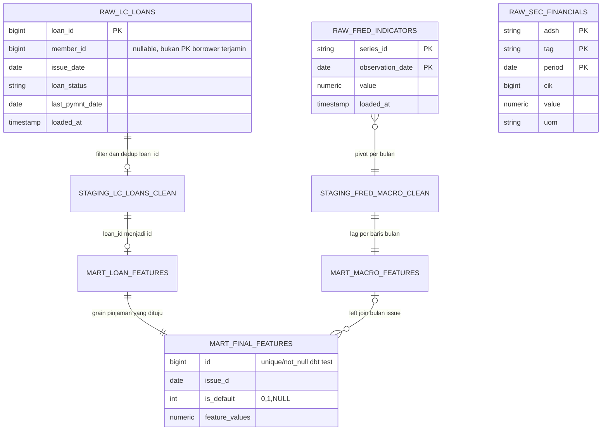

# ERD dan data dictionary

> Pembaruan operasional 10 September 2026: ingestion dan rebuild lokal selesai; raw/staging/loan/final masing-masing 2.260.668, schema loan_status TEXT. Snapshot audit lama di bawah dipertahankan sebagai konteks; status aktif ada di PROJECT_STATUS.md. Kontrak label/M1 masih draft: lihat M0_LABEL_DECISION_DRAFT.md.

> Status pemasangan 2026-09-08: arah v0.2 dan M0 disetujui. Detail implementasi di luar M0 tetap draft; ini bukan izin training penuh, deployment, atau rewrite.

v0.1 · DRAFT · Source SQL/ORM + skema live dibaca 2026-09-08. Definisi as-of/label belum disetujui.

## ERD aktual (relasi logis/lineage, bukan semua foreign key fisik)

Kardinalitas menunjukkan kontrak source yang diharapkan. Saat audit mart loan/final kosong sehingga relasi 1:1 belum terbukti pada data. dbt unique/not_null adalah tes, bukan deklarasi primary key SQL. Tidak ada relasi SEC→LC yang diimplementasikan. Loan adalah unit observasi, bukan orang; `applicant_id` API saat ini ambigu dan dipakai sebagai loan_id Feast.

## Tabel, grain dan state

| Tabel | Grain / key | Isi / availability |
|---|---|---|
| raw.lc_loans | satu loan_id BIGINT PK | Upsert overwrite status/pembayaran; tidak menyimpan riwayat snapshot per loan. loaded_at adalah waktu ingestion |
| raw.fred_indicators | (series_id, observation_date) PK | Empat seri; latest values di-upsert. Tidak menyimpan realtime_start/end atau publication timestamp |
| raw.sec_financials | (adsh, tag, period) PK | Satu filing/concept/period, uom menyatakan unit; raw saat ini kosong |
| staging.lc_loans_clean | satu loan_id lolos filter | View, pilih latest loaded_at, filter ID/tanggal/jumlah positif; is_default nullable |
| staging.fred_macro_clean | satu observation_month | Pivot rate/index/GDP; cpi_yoy_change adalah selisih index, bukan persen; GDP tidak benar-benar forward-filled pada SQL |
| mart.loan_features | satu id yang diharapkan | Table, loan_id→id, issue_date→issue_d; saat ini kosong |
| mart.macro_features | satu date=awal observation month | 954 baris; lag 3/6 adalah offset baris, hanya setara bulan jika kalender lengkap |
| mart.final_features | satu id yang diharapkan | loan features left join macro per issue month, 41 kolom live; kosong |
| monitoring.model_metrics | satu evaluasi per timestamp/model name | Tidak ada PK/run_id/model_version; metrics ROC/PR/KS/threshold/Brier/ECE |
| monitoring.drift_runs | satu pemeriksaan per timestamp | summary drift; tidak ada ID run eksplisit |
| monitoring.feature_drift | satu feature per run timestamp | PSI/KS/flag; hubungan ke drift_runs konvensi timestamp, bukan FK |
| monitoring.prediction_bins | satu interval bin per evaluasi/model | Histogram prediksi evaluasi, bukan event per request API |

## Kontrak fitur model saat ini: 24 numerik + 6 kategori

Semua fitur di bawah berasal dari `src/features/features.py`. Unit mengikuti SQL/data sumber; waktu tersedia harus ditetapkan terhadap **prediction_time**, bukan loaded_at.

| Kolom | Tipe/unit | Asal dan waktu tersedia / perhatian |
|---|---|---|
| loan_amnt | numerik, USD | jumlah pinjaman; pastikan proposed versus funded pada waktu keputusan |
| term_months | integer, bulan | parse term; tawaran tenor harus tersedia |
| int_rate | numerik, persen | harga pinjaman yang ditentukan lender; berpotensi sesudah keputusan |
| installment | numerik, USD/bulan | jadwal pembayaran setelah harga/tenor ditentukan |
| annual_inc | numerik, USD/tahun | income aplikasi; status verifikasi harus as-of |
| dti_eff | numerik, persen | dti yang NULL menjadi 0 di staging/mart; kehilangan missingness |
| installment_to_income_ratio | numerik, rasio | installment*12/annual_inc; income <=0 menjadi 0 sekarang, kebijakan perlu diubah/disepakati |
| revol_bal | numerik, USD | saldo revolving snapshot bureau aplikasi |
| revol_util_clean | numerik, rasio | revol_util persen /100; rentang tidak otomatis dijamin <=1 |
| total_acc | integer, count | akun kredit snapshot aplikasi |
| open_acc | integer, count | akun terbuka snapshot aplikasi |
| credit_history_age_months | numerik SQL/integer semantik, bulan | selisih kalender issue_date–earliest_cr_line; missing jadi 0 |
| has_delinq | 0/1 | delinq_2yrs >0; NULL dicoerce 0 |
| has_public_record | 0/1 | pub_rec >0; NULL dicoerce 0 |
| inq_last_6mths | integer, count | inquiries enam bulan sebelum snapshot |
| unemployment_rate | numerik, persen | UNRATE observation month; publication/vintage belum ada |
| unrate_lag3 | numerik, persen | UNRATE offset 3 baris bulan |
| unrate_lag6 | numerik, persen | UNRATE offset 6 baris bulan |
| cpi | numerik, index | CPIAUCSL; base index menurut metadata seri, bukan persen inflasi |
| cpi_lag3 | numerik, index | CPI offset 3 baris bulan |
| cpi_lag6 | numerik, index | CPI offset 6 baris bulan |
| fed_funds_rate | numerik, persen | FEDFUNDS observation month |
| fedfunds_lag3 | numerik, persen | rate offset 3 baris bulan |
| fedfunds_lag6 | numerik, persen | rate offset 6 baris bulan |
| home_ownership | string→category code saat ini | kategori aplikasi; mapping tidak disimpan |
| verification_status | string→category code | ketersediaan bergantung tahap verifikasi |
| purpose | string→category code | tujuan pinjaman aplikasi |
| addr_state | string→category code | state alamat; slice/proxy, bukan label demografi langsung |
| grade | string→category code | grade lender; availability dan tujuan benchmark harus jelas |
| sub_grade | string→category code | rincian grade lender; perhatian sama |

Numeric missing imputation saat ini menghitung median dari seluruh batch yang dimuat; categorical astype(str) lalu category codes. Nilai null bisa menjadi teks 'nan'/'None' sebelum fillna. Target desain memisahkan missing eksplisit, unknown category, invalid value dan kolom wajib; dtype/unit/order tidak dipilih diam-diam berdasarkan kolom tersedia.

## Kolom kendali dan larangan fitur

`loan_id/id` key lineage; `member_id` calon group untuk pemeriksaan overlap, bukan fitur score. `issue_date/issue_d` waktu origination. `loan_status/is_default` label/metadata, dilarang masuk X. `last_pymnt_date`, pembayaran kumulatif, recoveries adalah outcome pascapinjaman dan dilarang sebagai fitur origination. last_pymnt_date ada pada raw tetapi tidak dibawa ke staging/mart sekarang. `emp_length_years`, dti/revol_util mentah dan kolom lain dalam 41 kolom mart tidak semuanya dipakai model; pilih whitelist final setelah keputusan scope.

## Label dan point-in-time target desain

Kontrak minimum: prediction_time, data_as_of, outcome_observed_at, event_definition_version, horizon_months bila dapat diukur, label_available_at, cohort_eligibility_reason, feature_available_at; untuk FRED tambahkan observation_time dan vintage/publication time. Ini usulan schema, belum ada pada raw/mart sekarang.

Maturity berarti pinjaman telah cukup lama diamati untuk menentukan outcome pada horizon yang dipilih. Issue date <= train cutoff tidak cukup: outcome pinjaman Desember 2015 yang baru lunas Januari 2019 belum boleh diketahui model yang seolah dilatih Desember 2017. `loaded_at` baru juga tidak mengungkap kapan outcome awalnya diketahui. Tanpa event/as-of yang dapat dipertanggungjawabkan, persempit klaim ke retrospektif dan dokumentasikan censoring/selection bias.

Tes data yang direncanakan: nonempty semua layer wajib; rekonsiliasi raw→staging dengan alasan exclusion; unique key; join cardinality tidak menggandakan loan; label accepted values termasuk kebijakan NULL; calendar completeness sebelum LAG; availability <= prediction_time; train label_available_at <= train_as_of; subgroup counts; row IDs disjoint sesuai split. Jangan mengisi target current dengan 0.
