# Git dan Pull Request — catatan belajar dari CreditLens

11 September 2026. Catatan perintah yang relevan dengan alur kita, bukan seluruh subcommand Git. Panduan publikasi pertama ada di [M0_GIT_PUBLISH.md](M0_GIT_PUBLISH.md). Perintah di bagian “langkah sekarang” boleh dijalankan berurutan; contoh tahap berikutnya adalah materi penjelasan.

## Hasil yang sudah kamu kerjakan

Agatha membuat tiga commit, melakukan push, lalu membuka [draft PR #14](https://github.com/Agathahah/creditlens/pull/14). Pemeriksaan ulang menunjukkan:

| Bukti | Hasil |
|---|---|
| Branch sumber / head | codex/m0-mentoring, commit 7a859fe |
| Branch tujuan / base | main |
| Status PR | OPEN dan draft; belum merged |
| Commit tes mart | a37fcbd — test(dbt): detect empty and inconsistent loan marts |
| Commit ingestion | 79c7618 — fix(ingestion): preserve loan statuses and resume missing records |
| Commit dokumentasi | 7a859fe — docs: record M0 recovery and mentoring evidence |
| Author dan committer ketiganya | Agatha Silalahi, noreply Agathahah; tidak ada trailer Co-authored-by |
| CI untuk commit 7a859fe | Lint/typecheck sukses; tes 124 passed, 4 skipped, 8 warnings |
| Evaluasi model / build Docker | Skipped sesuai kondisi workflow; belum diuji oleh run PR ini |

Output “pending” yang kamu kirim benar pada waktu diperiksa. Pemeriksaan berikutnya menemukan run sudah selesai. Hasil CI melekat pada versi commit yang diuji: bila branch mendapat commit baru, tunggu hasil untuk commit baru itu.

## Git, GitHub dan gh berbeda tugas

| Istilah | Penjelasan sederhana | Contoh kita |
|---|---|---|
| Git | Program pencatat versi file; banyak operasinya berjalan lokal/offline | git add, git commit, git log |
| Repository / repo | File proyek dan riwayat versinya | Folder creditlens dan metadata .git |
| GitHub | Layanan penyimpan repo remote, PR dan CI | Agathahah/creditlens |
| gh | Program terminal untuk fitur GitHub; memerlukan akun/akses saat menghubungi GitHub | gh pr create, gh pr checks |
| Branch | Nama yang menunjuk rangkaian commit; memungkinkan perubahan dikerjakan terpisah | codex/m0-mentoring |
| main | Branch utama yang dipilih proyek; namanya tidak berarti otomatis siap produksi | Tujuan PR #14 |
| origin | Nama singkat untuk alamat remote | https://github.com/Agathahah/creditlens.git |
| HEAD | Posisi Git yang sedang aktif, biasanya mengikuti branch yang dipilih | HEAD → codex/m0-mentoring |
| origin/codex/m0-mentoring | Catatan lokal tentang posisi branch remote yang diketahui Git; bukan pemeriksaan GitHub terus-menerus | Terlihat setelah push/fetch |
| SHA / commit ID | Identitas sebuah commit; bentuk pendek cukup selama tidak ambigu | 7a859fe |
| Upstream | Branch remote yang dihubungkan dengan branch lokal | Dibentuk melalui git push -u |

`(base)` pada prompt menunjukkan environment Conda. `creditlens %` menunjukkan shell berada di folder creditlens. `creditlens=>` adalah psql. Perintah git/gh dijalankan di shell; keluar dari psql memakai `\q` terlebih dahulu. Jangan ikut menyalin teks prompt, simbol `%`, atau escape Markdown seperti `\_`.

## Alur file sampai PR

```mermaid
flowchart LR
    A[File kerja di laptop] -->|git add| B[Staging area Git]
    B -->|git commit| C[Commit pada branch lokal]
    C -->|git push| D[Branch di GitHub]
    D -->|gh pr create| E[PR: diff, diskusi dan CI]
    E -->|review dan merge| F[main di GitHub]
    F -->|fetch lalu integrasi lokal| G[main di laptop diperbarui]
```



Staging area Git adalah pilihan isi untuk commit. Schema staging PostgreSQL adalah lapisan transformasi data. Lingkungan staging deployment adalah tempat mencoba rilis sebelum produksi. Ketiganya berbeda meskipun memakai kata yang sama.

`git add` mengambil keadaan file saat perintah dijalankan. Jika file diubah lagi sesudahnya, perubahan terbaru belum otomatis masuk staging: periksa diff lalu add ulang. Commit menyimpan snapshot staging beserta pesan, identitas dan parent. Push mengirim commit yang dapat dijangkau branch; file untracked atau perubahan yang belum dicommit tidak ikut terkirim.

## Apa itu Pull Request?

Pull Request (PR) adalah pengajuan untuk menggabungkan perubahan dari branch sumber ke branch tujuan. PR #14 membandingkan codex/m0-mentoring dengan main. PR mengumpulkan daftar commit, perubahan file, alasan perubahan, komentar review dan hasil pemeriksaan otomatis di satu tempat.

“Pull request” berbeda dari `git pull`. Membuka PR tidak menarik file ke laptop dan tidak otomatis menggabungkan perubahan. PR tetap berguna ketika bekerja sendiri: kamu memiliki catatan alasan, hasil tes, keputusan dan batas perubahan yang bisa ditelusuri saat debugging atau interview.

| Keadaan PR | Artinya |
|---|---|
| Draft | Masih disiapkan; dapat direview dan menjalankan CI, belum siap digabung |
| Open, ready for review | Dinyatakan siap ditinjau; belum otomatis disetujui/merged |
| Merged | Perubahan sudah diintegrasikan ke base branch |
| Closed tanpa merge | Pengajuan ditutup tanpa integrasi melalui PR tersebut |

`mergeable` hanya menyatakan GitHub dapat menggabungkan branch menurut pemeriksaan konflik Git saat itu. Itu bukan penilaian kebenaran label, kualitas model atau kesiapan layanan.

## Membaca perintah tanpa menghafal semuanya

Pola umum: `git <operasi> <opsi> <argumen>`. Opsi biasanya diawali `-` atau `--`; `--` yang berdiri sendiri mengakhiri pembacaan opsi sehingga setelahnya dianggap path.

Contoh `git diff --cached --stat`: panggil Git → bandingkan perubahan → pilih staging vs commit terakhir → tampilkan ringkasan. Pada `git --no-pager diff --cached --stat`, `--no-pager` adalah opsi Git yang ditempatkan sebelum subcommand agar output langsung tampil di terminal.

| Perintah | Fungsi | Dampak |
|---|---|---|
| git status --short | Lihat file staged, modified, untracked | Baca-saja |
| git branch --show-current | Lihat branch aktif sebelum bekerja | Baca-saja |
| git remote -v | Lihat nama/alamat remote | Baca-saja |
| git var GIT_AUTHOR_IDENT | Lihat identitas author efektif untuk commit berikutnya | Baca-saja |
| git var GIT_COMMITTER_IDENT | Lihat identitas pencatat commit efektif | Baca-saja |
| git diff | Bandingkan file kerja dengan staging; melihat perubahan yang belum di-add | Baca-saja |
| git diff --cached | Bandingkan staging dengan commit terakhir | Baca-saja |
| git diff --cached --stat | Ringkas file dan jumlah baris staged | Baca-saja |
| git diff --cached --check | Periksa whitespace error dan conflict marker yang diperkenalkan perubahan | Baca-saja; tanpa output biasanya sukses, bukan pengganti tes |
| git add -- nama_file | Pilih isi file untuk commit berikutnya | Mengubah staging, tidak mengirim ke GitHub |
| git commit -m "pesan" | Simpan snapshot staged ke riwayat lokal | Membuat commit |
| git log -3 --oneline | Lihat tiga commit terbaru secara ringkas | Baca-saja |
| git log -3 --format=fuller | Lihat author/committer, tanggal dan pesan | Baca-saja |
| git show --stat HEAD | Lihat ringkasan commit terakhir | Baca-saja |
| git fetch origin | Ambil objek/info terbaru dari remote | Memperbarui catatan remote lokal; file kerja tidak diintegrasikan |
| git push -u origin codex/m0-mentoring | Kirim branch tertentu dan atur upstream | Mengubah branch GitHub |
| git pull --ff-only | Fetch lalu maju mengikuti upstream hanya jika tidak divergen | Mengubah branch/file lokal; menolak integrasi bila butuh merge baru |
| git switch nama_branch | Pindah branch dan menyesuaikan file kerja | Gunakan setelah memeriksa perubahan lokal |
| git switch -c nama_branch | Buat branch dari posisi kini lalu pindah | Untuk pekerjaan baru setelah base dipastikan benar |
| git restore --staged -- nama_file | Batalkan pemilihan file untuk commit | Isi file kerja tetap ada; berbeda dari restore yang menimpa file |

Pada output `status --short`, kolom pertama menunjukkan perbedaan staging terhadap HEAD, kolom kedua file kerja terhadap staging. `A ` berarti file baru sudah staged; ` M` berarti perubahan belum staged; `M ` berarti perubahan staged; `MM` berarti staged lalu diubah lagi; `??` berarti untracked. Empat *_CONTEXT.md kita sengaja tetap `??`.

Pesan commit kita memakai kategori: `test(dbt)` menjelaskan tes dbt; `fix(ingestion)` menjelaskan perbaikan ingestion; `docs` menjelaskan dokumentasi. Pesan membantu menelusuri maksud perubahan, bukan bukti semua file di dalamnya otomatis benar.

Awalan `GRAPHIFY_SKIP_HOOK=1` berlaku untuk perintah commit tersebut dan memakai opt-out hook Graphify yang sudah ada. Itu bukan opsi Git dan bukan perubahan identitas. Nama/email Git menentukan author/committer; login `gh` menentukan akun yang mengoperasikan GitHub. Bantuan AI tetap dijelaskan jujur dalam learning log meski tidak menjadi trailer commit.

## Perintah GitHub yang sedang kita pakai

| Perintah/opsi | Artinya |
|---|---|
| gh pr create | Membuat PR baru; tidak diperlukan lagi untuk PR #14 |
| --repo Agathahah/creditlens | Tentukan repo GitHub secara eksplisit |
| --base main | Branch tujuan penggabungan |
| --head codex/m0-mentoring | Branch yang membawa perubahan |
| --draft | Buat dalam keadaan draft |
| --title "..." | Judul PR |
| --body-file docs/M0_PR_BODY.md | Baca isi deskripsi PR dari file saat perintah dijalankan |
| gh pr view 14 | Baca informasi PR yang sudah ada |
| --json number,url,state,isDraft | Tampilkan field tertentu dalam format terstruktur |
| gh pr diff 14 --name-only | Baca daftar file PR |
| gh pr checks 14 | Baca keadaan pemeriksaan otomatis |
| gh pr checks 14 --watch | Pantau sampai pemeriksaan selesai; Ctrl+C menghentikan pemantauan lokal, bukan membatalkan CI |
| gh run view ID_RUN --log-failed | Baca log bagian job yang gagal untuk diagnosis |

Baris perintah panjang dapat disambung dengan satu `\` di ujung baris. Tidak boleh ada karakter/spasi setelah backslash tersebut. Tanda kutip menjaga pesan/judul dengan spasi menjadi satu argumen. Notifikasi versi baru `gh` adalah informasi pembaruan; tidak berarti PR gagal dan upgrade tidak diperlukan untuk melanjutkan langkah ini.

PR mengikuti branch sumber. Commit baru yang di-push ke branch yang sama otomatis memperbarui PR #14; tidak perlu PR baru. Namun, mengedit file M0_PR_BODY.md kemudian push tidak otomatis mengganti deskripsi PR yang sudah ada: deskripsi adalah state GitHub tersendiri.

## Mengapa layar berhenti di (END)?

Git sering membuka output panjang melalui pager `less`. `(END)` berarti kamu sudah melihat akhir output. Tekan `q` tanpa Enter untuk kembali ke shell; Space maju halaman, b mundur halaman, panah untuk bergerak. Ini tidak membatalkan commit atau menghapus perubahan.

Untuk ringkasan tanpa pager:

```bash
git --no-pager diff --cached --stat
git --no-pager log -3 --oneline
```

## Membaca CI tanpa keliru menafsirkannya

CI (Continuous Integration) menjalankan pemeriksaan otomatis ketika ada perubahan tertentu. Definisi job kita ada di .github/workflows/ci.yml. GitHub memakai runner terpisah dari Mac kamu; passing di sana memberi bukti bahwa pemeriksaan tersebut juga berhasil pada lingkungan CI.

| Status | Makna dan tindakan |
|---|---|
| Pending / in progress | Masih antre/berjalan; baca ulang atau pakai --watch |
| Success | Job yang disebut selesai sukses; baca cakupannya |
| Failure | Baca job/step/log gagal, perbaiki penyebab lalu commit/push perubahan |
| Skipped | Job/tes tidak dijalankan, bukan lulus |
| Cancelled | Run dihentikan; misalnya digantikan commit lebih baru |

Run 34504952839: 124 tes pass, 4 skipped, 8 warnings. Empat tes yang dilewati terdiri dari dua integrasi Feast live dan dua kasus DeepSurv opsional. Coverage yang dilaporkan 91% keseluruhan scope src, yang juga mencakup file tes; modul ingestion sendiri 54%. Delapan cek transaksi/migration/resume PostgreSQL dibuktikan di runner lokal tersendiri, belum terhubung ke CI. Coverage mengukur baris yang tersentuh pengujian, bukan probabilitas kode benar.

Model Evaluation Gate hanya aktif pada push main; build Docker hanya pada tag v*. Karena ini PR, kedua job dilewati. Artefak model standar masih belum tersedia menurut audit kita: merge nanti dapat memicu kegagalan gate evaluasi yang berbeda dari hasil hijau PR. Rancangan perbaikannya termasuk pekerjaan evaluasi/rilis yang belum selesai; jangan menonaktifkan gate sekadar agar tampak hijau.

## Langkah sekarang — commit catatan ini ke PR yang sama

Lokasi: shell Terminal Mac, root repo. Semua materi sesi ini berupa dokumentasi; database dan source aplikasi tidak berubah.

1. Periksa keadaan dan hasil CI versi yang sudah dipush:

```bash
cd /Users/agathasilalahi/Documents/creditlens
git status --short
gh pr checks 14 --repo Agathahah/creditlens
```

Harapan: catatan sesi ini modified/untracked; empat konteks lama tetap untracked. Hasil untuk 7a859fe: dua job success, dua skipped.

2. Pilih tepat catatan baru/perubahannya:

```bash
git add -- docs/GIT_PR_CATATAN_PEMULA.md docs/audit/M0_PR14_CI_REPORT.json
git add -- PROJECT_STATUS.md LEARNING_LOG.md docs/WORKLOG.md docs/README.md
git --no-pager diff --cached --stat
git diff --cached --check
```

Harapan enam file dokumentasi/evidence terpilih; --check tanpa output. `--stat` tidak masuk pager karena --no-pager. Empat file konteks lama tidak dipilih.

3. Catat versi dan kirim ke branch yang sama:

```bash
GRAPHIFY_SKIP_HOOK=1 git commit -m "docs: explain Git workflow and record PR 14 validation"
git push origin codex/m0-mentoring
```

Harapan commit baru dan push sukses. Push memperbarui PR #14 otomatis dan memicu run PR baru. Tidak mengubah main. Tidak perlu menjalankan gh pr create lagi.

4. Periksa bahwa GitHub sudah menerima commit terbaru:

```bash
git --no-pager log -1 --oneline
gh pr view 14 --repo Agathahah/creditlens --json url,headRefOid,isDraft
gh pr checks 14 --repo Agathahah/creditlens --watch
```

Harapan awal headRefOid cocok dengan SHA commit baru dan isDraft true. Sesaat setelah push checks bisa belum terdaftar; periksa ulang setelah run muncul. Untuk melihat daftar run: `gh run list --repo Agathahah/creditlens --branch codex/m0-mentoring --limit 3`. Jangan menyimpulkan hasil hijau commit lama sudah memverifikasi commit baru. Kirim SHA terbaru dan ringkasan checks; jika perintah gagal, kirim error pertama.

## Setelah tahap ini: review, merge, lalu produksi adalah keputusan berbeda

Review PR menilai apakah perubahan sesuai tujuan, apakah tes menangkap kegagalan yang relevan, dan apakah batasnya jujur. Menjadikan PR ready (`gh pr ready`) mengubah status review. Merge (`gh pr merge`) menulis ke main; kedua tindakan belum dijalankan atau ditugaskan dalam sesi catatan ini. Setelah merge benar-benar selesai, main lokal perlu diperbarui dengan switch/fetch/pull yang sesuai state saat itu. Jangan menjalankan pull saat belum memahami branch/upstream yang akan diintegrasikan.

M0 memperbaiki fondasi data, tetapi M0 masih punya keputusan provenance/as-of/label. M1 menangani preprocessing dan evaluasi; M2 bundle/API; M3 CI/release/rollback; M4 monitoring; M5 review kesiapan dan interview. CI PR hijau menjadi satu bukti software, bukan keputusan akhir produksi. Pushing kode juga tidak memindahkan database, mengisi data di server lain, menjalankan migration, atau menerbitkan API secara otomatis pada workflow sekarang.

Kalimat interview yang sesuai bukti saat ini: “Saya menjalankan verifikasi SQL, memisahkan perubahan menjadi tiga commit, mem-push branch dan membuka draft PR. Saya memeriksa lint serta tes CI dan membedakan hasil pass dari skip. Implementasi dan dokumentasi dibantu Codex; evaluasi model dan kesiapan produksi masih pekerjaan berikutnya.” Ubah klaim hanya setelah pekerjaan dan pemahaman tambahan terbukti.
