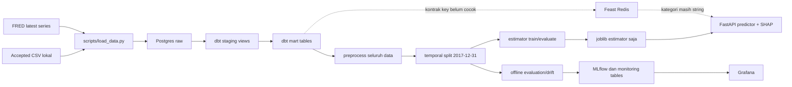

# Technical design dan walkthrough

> Pembaruan operasional 10 September 2026: ingestion dan rebuild lokal selesai; raw/staging/loan/final masing-masing 2.260.668, schema loan_status TEXT. Snapshot audit lama di bawah dipertahankan sebagai konteks; status aktif ada di PROJECT_STATUS.md. Kontrak label/M1 masih draft: lihat M0_LABEL_DECISION_DRAFT.md.

> Status pemasangan 2026-09-08: arah v0.2 dan M0 disetujui. Detail implementasi di luar M0 tetap draft; ini bukan izin training penuh, deployment, atau rewrite.

v0.2 · DRAFT · Actual source/DB 2026-09-08 dipisahkan dari usulan target.

## Alur aktual

Diagram menggambarkan source, bukan bukti semua panah berjalan. Raw/staging terisi; mart pinjaman kosong. API tidak menulis event prediction ke monitoring. SEC loader ada tetapi tidak ada join ke model. Airflow mempunyai tiga DAG, namun dependency antar-DAG berbasis keberhasilan belum diimplementasikan.

## Satu record yang benar-benar ditelusuri

1. **CSV aktual**: record pertama accepted gzip, id `68407277`, issue_d `Dec-2015`, amount 3600 USD, term 36 months, installment 123.03 USD/bulan, annual_inc 55000 USD/tahun, revol_util 29.7%, home_ownership MORTGAGE, grade C, status Fully Paid, last payment Jan-2019. Identitas personal/alamat tidak dimasukkan laporan.
2. **Raw aktual**: query untuk ID tersebut menemukan `loan_id=68407277`, `issue_date=2015-12-01`, `last_pymnt_date=2019-01-01`; loader mengganti nama tanggal dan tipe numerik, upsert menurut loan_id.
3. **Staging aktual**: record yang sama ada, `is_default=0`. SQL memilih record terbaru, melakukan filter, dan membentuk target. Menghitung formula mart melalui SELECT baca-saja menghasilkan installment/income `0.02684290909090909091` dan utilization `0.297`.
4. **Mart menurut source, belum menjadi baris aktual**: loan_id menjadi id, issue_date menjadi issue_d, tenor diparse 36; left join macro untuk Desember 2015. Query langsung mart final tidak dapat menemukan record karena tabel kosong. Belum ada bukti nilai macro untuk record final.
5. **Fitur/model menurut source**: 24 numerik + 6 kategori, median dan kode kategori dihitung dari batch lengkap; split memasukkan issue Desember 2015 ke train <=2017-12-31. Namun last payment Januari 2019 menunjukkan mengapa cutoff issue tidak cukup untuk menjamin label tersedia pada 2017. Kode kategori MORTGAGE tidak boleh ditebak dari satu record.
6. **Artefak/API menurut source**: estimator disimpan sebagai joblib; startup memuat predictor dan TreeExplainer. POST /predict meminta fitur numerik yang sudah diolah atau lookup Feast. Hasil memiliki score, tier, approved dan latency; tidak ada probabilitas aktual yang dapat dilaporkan karena artefak standar absen. `/explain` mengembalikan SHAP; startup tidak memasang DiCE. `/survival` membutuhkan registry yang belum dimuat startup.
7. **Monitoring menurut source**: evaluator CLI bisa log metrik/plot ke MLflow dan agregat ke PostgreSQL, Grafana membacanya. Satu request API ini belum memiliki event/model_version yang dapat diikuti ke dashboard. Jadi walkthrough runtime lengkap berhenti pada staging, lalu dilanjutkan sebagai penjelasan source.

## Target inti yang diusulkan

```mermaid
flowchart LR
    DATA[Snapshot publik + provenance] --> SQL[SQL kontrak data dan waktu]
    SQL --> MAN[Dataset manifest + eligibility]
    MAN --> SPL[Train / validation / frozen test]
    SPL --> FIT[Fit transform dan model hanya train]
    FIT --> VAL[Calibration dan threshold di validation]
    VAL --> BUN[Immutable model bundle]
    BUN --> GATE[Evaluate frozen test + integration gate]
    GATE --> REL[Versioned release manifest]
    REL --> SERV[API raw feature contract]
    SERV --> OBS[Inference events + metrics]
    OBS --> HUMAN[Runbook dan review manusia]
```

Bundle: preprocessor, estimator, ordered schema/types/units, missing/unseen rules, label definition/horizon, calibration dan threshold, code SHA, dataset/split manifest IDs, seed, package versions, metrics, checksum serta explanation output-space. Model bundle berasal dari pipeline terpercaya; hanya checksum yang tervalidasi boleh dimuat. Pisahkan direktori model release dari `models/` SQL dbt dalam desain path yang nanti disepakati.

API menerima feature values domain yang belum di-encode; satu adapter menjalankan transform bundle. Fitur turunan harus memiliki formula yang sama dengan SQL, dibuktikan parity test. Online Feast hanya diaktifkan setelah ID/type/schema/date materialization dan kategori diuji dengan record ada; sebelum itu gunakan jalur inline yang lengkap dan jelas. Ini tidak menghapus Feast atau menulis ulang PR 11. `loan_id` dan `request_id` menjadi konsep terpisah; request berulang tidak menggunakan loan_id sebagai ID transaksi unik.

Pisahkan `/live` (proses merespons) dan `/ready` (bundle valid dan score path sehat; dependencies yang wajib sesuai mode tersedia). Bundle hilang/rusak/tidak cocok -> 503 readiness, bukan release sukses. Untuk explain, nyatakan ruang output SHAP dan gunakan background data train yang konsisten bila diperlukan. Optional survival/counterfactual memiliki readiness/availability terpisah.

Rilis terdiri dari candidate path immutable, gate, manual promotion, image/bundle manifest, smoke score/explain, lalu pointer versi aktif. Jangan menimpa artefak aktif sebelum gate. Rollback mengembalikan pasangan image+bundle+schema-compatible config sebelumnya. Etl/train/monitoring diatur dengan dependency keberhasilan dan snapshot ID, bukan asumsi jam jadwal.

Monitoring target: request_id, pseudonymous loan key bila perlu, model/data-contract version, timestamp, status, latency, input validation failures, prediction bin; label matang dihubungkan kemudian. Catat agregat tanpa data personal atau secrets. Referensi drift dibekukan dari train; current window adalah traffic terbaru, termasuk belum berlabel. Drift memicu investigasi manusia, tidak otomatis retrain/promote.

## Lingkungan Mac dan rollout

M3 16 GiB: jalankan Postgres dan API/baseline dahulu; subset berbasis cohort waktu, kolom minimal, dua thread sebagai batas awal percobaan, ukur peak RSS. Airflow, MLflow, Redis dan Grafana diaktifkan bertahap saat milestone membutuhkan. Tidak menjalankan DeepSurv atau seluruh 1,6M-row DataFrame berulang tanpa pengukuran. `SELECT *` dan beberapa copy DataFrame dalam kode sekarang adalah risiko memori yang perlu diuji, bukan bukti sudah OOM.

Rollout dimulai lokal, kemudian staging terisolasi untuk validasi konfigurasi, schema, bundle, smoke tests dan rollback. Target host, akses dan kapasitas ditentukan setelah benchmark. Credentials melalui environment/secret store, bindings internal dan CORS sesuai origin yang dibutuhkan. Deployment memerlukan keputusan rilis tersendiri.
